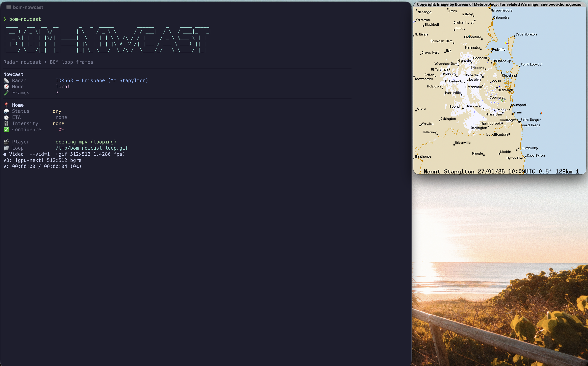

# bom-nowcast — BOM radar CLI + nowcast

A fast, friendly **BOM radar CLI** for Australia: fetch Bureau of Meteorology radar frames, render a readable loop with emoji pins, and run a lightweight rain nowcast from your terminal.

This project intentionally avoids BOM FTP (which is often the source of hangs/timeouts) and instead scrapes the BOM **loop pages** and downloads the timestamped PNG frames over HTTPS.



## Features

- Interactive setup (choose radar, set your default location, add emoji pins)
- Default run opens a looping radar GIF in `mpv`
- Cached frame fetch + auto-pruning
- Human-friendly loop rendering (background + labels + emoji pins)
- Basic rain nowcast with ETA window + intensity (likely + peak)
- Intensity ordering follows the BOM legend (white = light rain, black = hail)

## Why this CLI?

- **BOM radar from the terminal**: quick checks without opening a browser
- **Australia-focused**: uses Bureau of Meteorology loop pages over HTTPS
- **Readable output**: labels + context map + emoji pins for locations

If you searched for *bom cli radar*, *Bureau of Meteorology radar CLI*, *Australian weather radar command line*, or *BOM radar GIF*, this is the tool.

## Prerequisites

- Node.js
- ImageMagick (`magick` or `convert`) **optional but recommended** for GIF loops
- `mpv` **optional but recommended** for the default loop player

## Install

From this folder:

```bash
npm install
npm link
```

If you prefer not to link globally, you can always run via `node bom-nowcast.js ...`.

## Quick start

```bash
bom-nowcast setup
bom-nowcast
```

## Commands

### Setup

Config lives at:

- `~/.config/bom-nowcast/config.json`

Interactive setup (recommended):

```bash
bom-nowcast setup
```

If you prefer to create a default config without prompts:

```bash
bom-nowcast config-init
```

### Default run (no arguments)

```bash
bom-nowcast
```

It will:

1) Ensure you have a config (launches setup if missing)
2) Render the latest loop with your emoji pins
3) Open it in `mpv` and loop until you close it

### Locations (home/work/uni)

List locations:

```bash
bom-nowcast locations
```

Add a location:

```bash
bom-nowcast location-add --name Work --lat -27.XXXX --lon 153.XXXX
```

Add a location with an emoji marker:

```bash
bom-nowcast location-add --name Work --lat -27.XXXX --lon 153.XXXX --emoji 🧭
```

Set a location as the default:

```bash
bom-nowcast location-add --name Default --lat -27.874798 --lon 153.296172 --set-default
```

### List supported radars

```bash
bom-nowcast radars
```

### Fetch latest frames (cached + auto-prune)

```bash
bom-nowcast fetch --radar IDR663 --frames 10
```

Cache location:

- `~/.cache/bom-nowcast/<RADAR_ID>/`

### Build a human-friendly radar loop GIF (with map underlay + labels + location emojis)

```bash
bom-nowcast loop --radar IDR663 --frames 7 --out /tmp/bom-nowcast-context.gif
```

Open it:

```bash
open /tmp/bom-nowcast-context.gif
```

### Nowcast (MVP)

Nowcast supports either:

- a named location from your config (recommended), or
- an explicit `--lat/--lon`

```bash
# Use your default configured location
bom-nowcast nowcast --frames 7 --mode local

# Use a named location
bom-nowcast nowcast --location Work --frames 7 --mode local

# Nowcast all configured locations
bom-nowcast nowcast --all --frames 7 --mode local

# Or pass lat/lon explicitly
bom-nowcast nowcast --lat -27.874798 --lon 153.296172 --frames 7 --mode local
```

Notes:
- `--mode local` focuses on a window around the target (better for “is it coming toward me?”)
- `--mode global` uses the broader precip field (can be noisier)
- ETA is shown as `X ± N` minutes (a window around the median arrival time)
- Intensity reports a likely band plus the peak band

## Supported radars (built-in)

- IDR664 — Brisbane (Mt Stapylton 64 km)
- IDR663 — Brisbane (Mt Stapylton 128 km)
- IDR503 — Brisbane (Marburg)
- IDR713 — Sydney (Terrey Hills)
- IDR023 — Melbourne (Laverton)
- IDR643 — Adelaide (Buckland Park)
- IDR703 — Perth (Serpentine)
- IDR633 — Darwin (Berrimah)
- IDR763 — Hobart (Mt Koonya)

## Design notes

We keep **machine-readable** frames separate from **human-readable** composites:

- Machine-readable: raw timestamped PNG frames from the loop page (best for analysis)
- Human-readable: composited frames (background + labels) for GIF output

## FAQ

**Is this an official BOM tool?**  
No. It’s a community CLI that uses public Bureau of Meteorology loop pages over HTTPS.

**Does it use BOM FTP?**  
No. It avoids FTP and downloads the timestamped PNG frames from the loop pages.

**What platforms are supported?**  
Anywhere Node.js runs. ImageMagick and `mpv` are optional helpers for GIFs and playback.

**Which radar should I choose?**  
Pick the radar closest to your area from `bom-nowcast radars`.

**Can I run it without a GUI?**  
Yes. Use `fetch` and `nowcast` only, or write GIFs to a file path and view later.

## References

- BOM loop pages: https://reg.bom.gov.au/products/
- BOM radar transparencies (legend/background/labels): https://reg.bom.gov.au/products/radar_transparencies/
